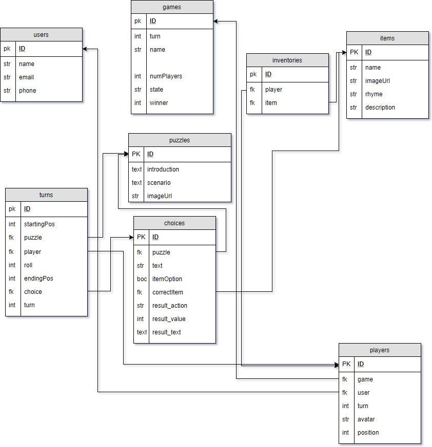

# Jumanji

<h1>Welcome to the Jungle!</h1>

Jumanji is a full-stack web application based on the movie and board game of the same name

<a href="http://guarded-tor-71480.herokuapp.com/">See the game on Heroku</a>

<ul><h2>Team:</h2>
  <li>Angela Polly - game board, front-end logic, design, art</li>
  <li>Daniel McGeough - creative content</li>
  <li>MarCayce Crosby - front end design and layout</li>
  <li>Richard Staub - database, API, game logic, front-end scripting, team lead</li>
</ul>

<ul><h3>The application was created using the following:</h3>
<li>Node.js</li>
<li>Express for Node</li>
<li>Sequelize ORM</li>
<li>MySQL Database</li>
<li>a RESTful API</li>
<li>JQuery / AJAX</li>
<li>Javascript</li>
<li>Bootstrap</li>
<li>Twilio SMS API</li>
<li>MVC Architecture</li>
</ul>

<h2>The Jumanji Game ERD</h2>
